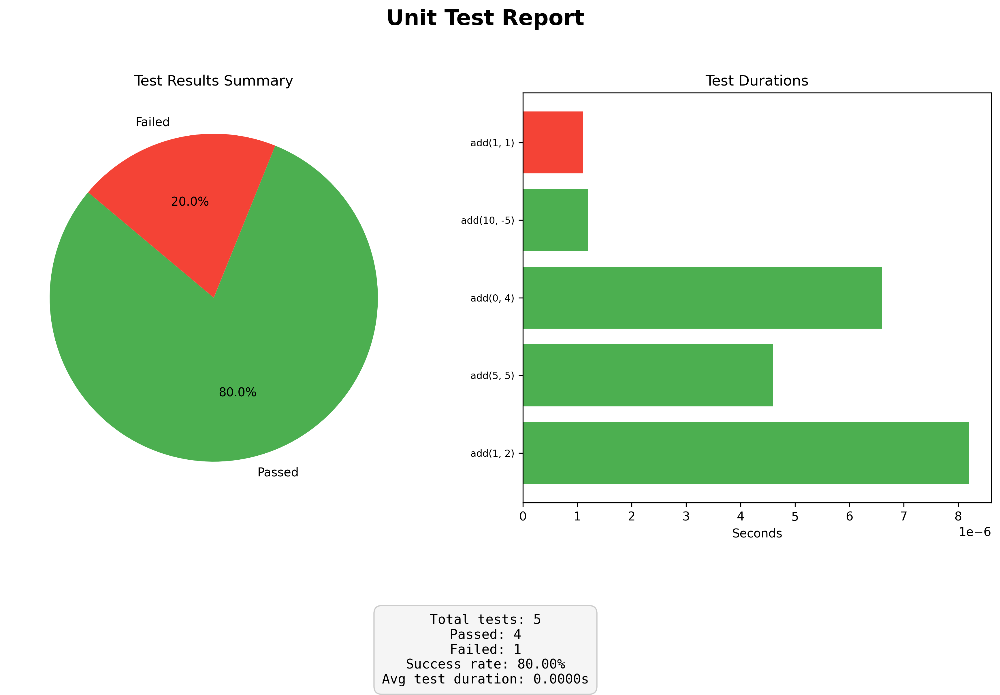

# PyUnittester

**A simple, yet powerful Python unit testing framework with detailed reports, timing, and optional graphical visualization.**

`PyUnitTester` is designed to be a lightweight alternative for writing and running unit tests, providing clear, color-coded output and performance metrics for each test case.

---

## ✨ Features

* **Color-Coded Console Output:** Clear distinction between passed and failed tests using ANSI colors (Green, Red, Yellow).
* **Detailed Timing:** Measures and reports the duration of every test case, showing overall runtime and the slowest test.
* **Slow Test Highlighting:** Automatically flags tests slower than a configurable threshold.
* **Exception Reporting:** Provides the root cause location (filename, line number, code) for any exceptions encountered during a test.
* **`stdout` Capture:** Captures and reports `print()` statements from within test functions with timing offsets.
* **Graphical Reports:** Optional visualization of test results (Pass/Fail pie chart, and test durations bar chart) using `matplotlib`.
* **Customizable Test Cases:** Supports multiple ways to define tests using tuples, lambdas, or `TestCase` objects.

---

## 🚀 Getting Started
### 1. Define a Function and Test Cases
#### Testing function add
``` python
def add(a, b):
    # Imagine this function occasionally prints debug info
    if a == 0 or b == 0:
        print(f"Adding {a} and {b}. One operand is zero.")
    return a + b
```
#### Testcases
Option A: Using tuples (args, kwargs, expected)
``` python
testcases = [
    ((1, 2), {}, 3),                 # add(1, 2) -> 3
    ((5, 5), {}, 10),                
    ((0, 4), {}, 4),                 # add(0, 4) -> 4 (Triggers stdout capture)
    ((10, -5), {}, 5),               
    ((1, 1), {}, 3),                 # INTENTIONAL FAIL: 1+1 != 3
]
```
Option B: Using the TestCase dataclass for clarity
``` python
testcases = [
    TestCase(args=(2, 3), expected=5),
    TestCase(args=(-1, -1), expected=-2),
    TestCase(args=(10,), kwargs={'b': 10}, expected=20),
]
```

### 2. Add testblocks
```python
import pyunittester

tester = pyunittester.UnitTester()
tester.add_block(func=add, testcases=testcases)
tester.run()
```
#### Output
> INFO: No ANSI colors here, but terminal output does contain colors
```bash
Running tests for: add [t=16:48:57;324ms;608µs]
4/5 testcases passed! [avg 4.3400µs, t=16:48:57;425ms;284µs]
	 ↳ add(1, 2) → 3 [t+6.1000µs]

	 ↳ add(5, 5) → 10 [t+4.4000µs]

	 ↳ add(0, 4) → 4 [t+8.7000µs]

        ↳ stdout [t=16:48:57;323ms;015µs]:
        	↳ [t+3.5000µs]:	Adding 0 and 4. One operand is zero.

	 ↳ add(10, -5) → 5 [t+1.2000µs]

	↳ add(1, 1); expected 3, got 2 [t+1.3000µs]


Summary: 4/5 (80.0000%) testcases passed!
Total runtime: 100.81ms
Slowest test: add(0, 4)
Failures:
	↳ add(1, 1); expected 3, got 2 [t+1.3000µs]

```
### (Optional) Add chart
#### Use `pyunittester.chart.visualize_unit_test_report`
```python
import pyunittester.core

tester = pyunittester.UnitTester()
tester.add_block(func=add, testcases=testcases)
visualize_unit_test_report(tester.run(), True)
```
#### Output


## Contributing

Contributions are welcome!  Please feel free to submit pull requests or open issues.

---

## TODO
*   Add debugging features.
*   Add support for asynchronous (async) functions.

---

<br>
PyUnittester 2025<br>
Author: @RanveerisdeGOAT,<br>
Co-Authors: Deepseek, Gemini, ChatGPT ;)<br>
Open source: Free to use, modify and improve: https://github.com/RanveerisdeGOAT?tab=repositories
